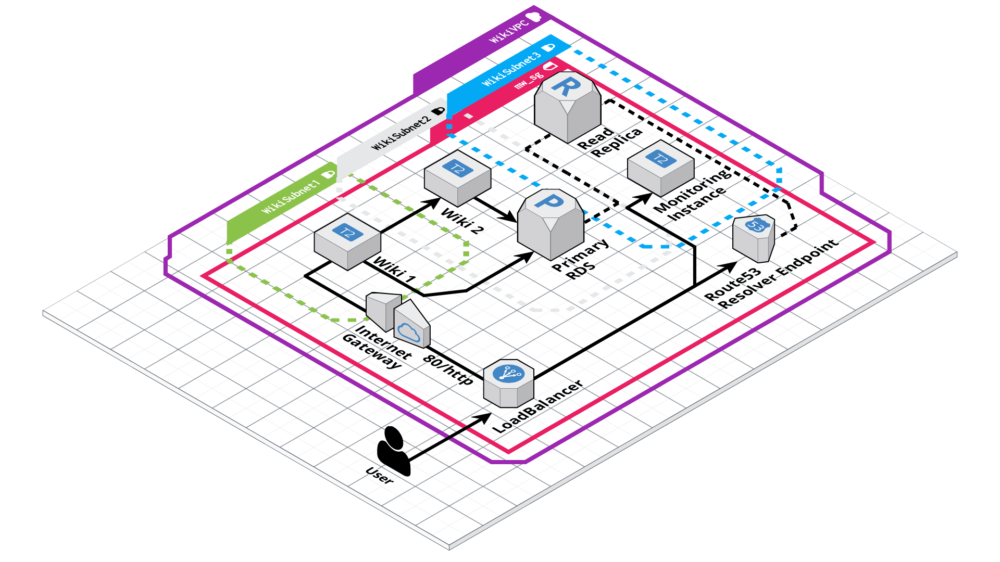

# Apresentação
Arquitetura pensada em aplicações com forte demanda operacional sendo constuída em multi-az, instâncias EC2 + instância RDS. Tal arquitetura serve como teste de construção de infraestrutura utilizando IAC, neste repositório foi utilizado o provider AWS sendo construída a partir de módulos terraform.

# Sobre
A construção dessa arquitetura foi pensada em disponibilidade e resiliencia de qualquer plataforma que seja instalada em arquitetura, com isso temos alguns pontos com relaçào a VPCs e subnets distintas para cada recurso. Alguns pontos que foram levantados a serem seguidos em stack:
- multi-az em instâncias EC2
- Réplicas viáveis de Instâncias RDS
- Criação de DNS respondendo em Endpoint de Instância RDS
- Entrega de infraestruta por CI

# Diagrama de Infraestrtura
Diagrama mostra a utilização de arquitetura pela utilizqção de usuario atendido por serviço em instâncias EC2 que realizam inserções em databases RDS. Numero de Resources:
- 1 VPC
- 3 Subnets 
- Internet Gateway
- 1 SecurityGroup
- 2 Instâncias EC2 (LoadBalancer type)
- 2 Instâncias RDS (type Primary, type Replica)
- Entradas Route53 para Endpoint RDS Primary

# Execução manual código terraform
A execução do código _main.tf_ consiste em alguns pontos para ser executado de maneira correta:\
1. Existir ou Modificar a config de um profile para `pessoal-profile`, confira essa informação em `~/.aws/config`
2. Execute o comando de carregamento dos módulos com `terraform init`
3. O parâmetro plan, traz um preview das configurações que serão implementadas: `terraform plan`
3. Por ultimo, execute o código terraform executando `terraform apply --auto-approve`

# In Progress

[x] CI
[x] RDS Endpoint resolved
[x] Regra de trafego em LoadBalancer 

